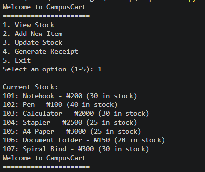
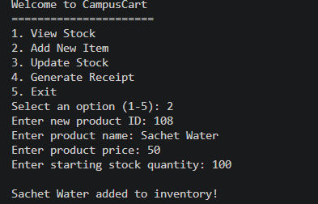
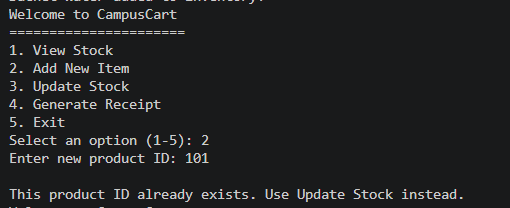
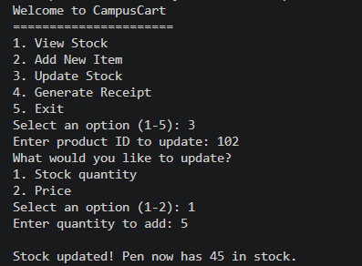
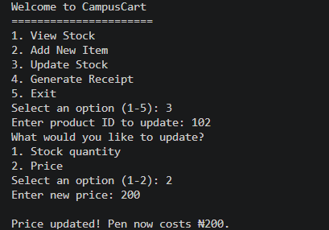
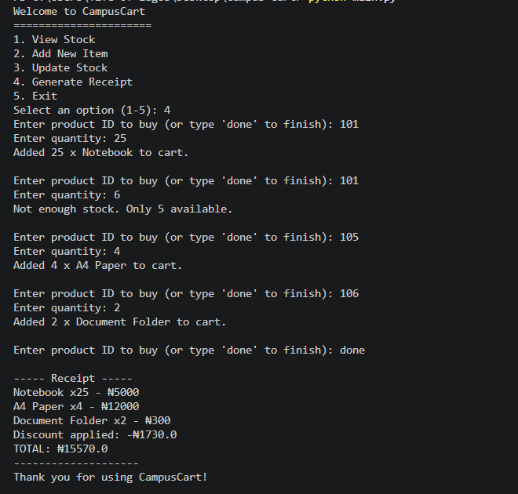
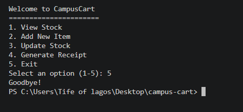

# CampusCart

> A lightweight, fast command-line tool that helps campus vendors manage stock, totals, and receipts.

---

## Overview

CampusCart is a command-line tool designed to help campus vendors manage day-to-day sales operations, tracking inventory, calculating totals, and generating receipts, without relying on manual calculations or paper records.

## Problem Statement

Campus vendors, including small food sellers and pop-up shops, typically manage stock, pricing, and orders manually. This often results in inaccurate stock counts, pricing errors during peak periods, and slower service. CampusCart addresses this by providing a lightweight tool that automates inventory tracking and receipt generation, without requiring complex software or infrastructure.

## Target Users

- Student-run businesses on campus
- Pop-up vendors selling food, snacks, or accessories
- Small campus shops without access to formal point-of-sale systems

## Core Features

- Add and update stock items
- Track item prices and quantities
- Calculate cart totals automatically
- Generate simple, readable receipts

## Value Proposition

- **Fast setup** — minimal configuration required to begin use
- **Improved accuracy** — reduces manual errors in stock tracking and pricing
- **Efficient receipts** — generates clear, itemized receipts instantly
- **Purpose-built** — designed specifically for the operational needs of small campus vendors

## User Personas

| Persona | Role | Core Need |
| :--- | :--- | :--- |
| **Vendor** | Campus food or goods seller | A reliable way to track stock and calculate totals accurately during high-demand periods |
| **Customer** | Student purchasing from a vendor | An accurate total and a clear receipt with minimal wait time |

Understanding these two perspectives ensures CampusCart supports both sides of a transaction, not just inventory management in isolation.

## Proposed CLI Interface

```
Welcome to CampusCart
======================
1. View Stock
2. Add New Item
3. Update Stock
4. Generate Receipt
5. Exit

Select an option: _
```
## Getting Started

The CLI application has been built in Python. To run it:

​```
python main.py
​```

This launches the interactive menu shown below.

## CLI Demo

### Viewing Stock


### Adding a New Item


### Preventing Duplicate Product IDs


### Updating Stock Quantity


### Updating Price


### Generating a Receipt


### Exiting the Program
